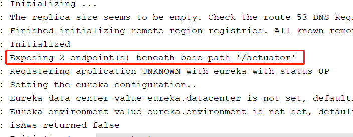
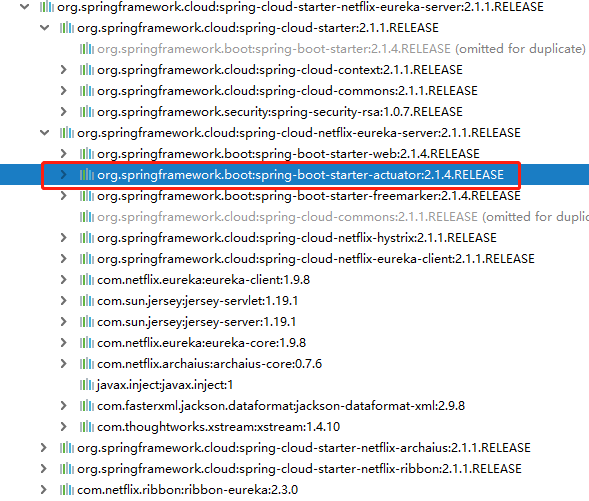
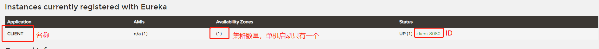
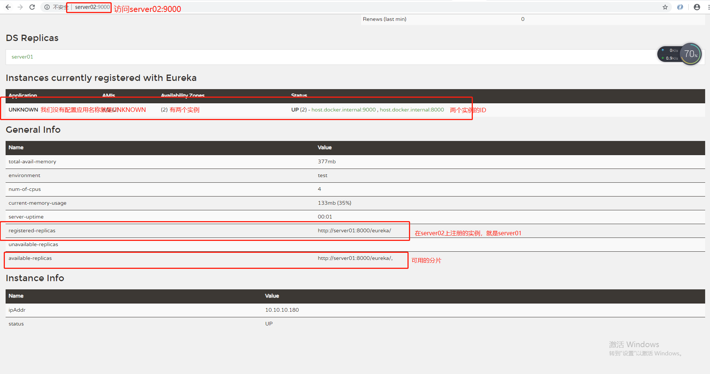

Spring Cloud 学习 之 Spring Cloud Eureka（二）

Spring Boot版本：2.1.4.RELEASE

Spring Cloud版本：Greenwich.SR1

[TOC]

#### 搭建服务注册中心：

pom文件如下：

```xml
<?xml version="1.0" encoding="UTF-8"?>
<project xmlns="http://maven.apache.org/POM/4.0.0" xmlns:xsi="http://www.w3.org/2001/XMLSchema-instance"
         xsi:schemaLocation="http://maven.apache.org/POM/4.0.0 http://maven.apache.org/xsd/maven-4.0.0.xsd">
    <modelVersion>4.0.0</modelVersion>
    <parent>
        <groupId>org.springframework.boot</groupId>
        <artifactId>spring-boot-starter-parent</artifactId>
        <version>2.1.4.RELEASE</version>
        <relativePath/> <!-- lookup parent from repository -->
    </parent>
    <groupId>com.study</groupId>
    <artifactId>spring-cloud</artifactId>
    <version>0.0.1-SNAPSHOT</version>
    <name>spring-cloud</name>
    <description>Demo project for Spring Boot</description>

    <properties>
        <project.build.sourceEncoding>utf-8</project.build.sourceEncoding>
        <java.version>1.8</java.version>
    </properties>

    <dependencies>
        <dependency>
            <groupId>org.springframework.boot</groupId>
            <artifactId>spring-boot-starter</artifactId>
        </dependency>

        <dependency>
            <groupId>org.springframework.boot</groupId>
            <artifactId>spring-boot-starter-test</artifactId>
            <scope>test</scope>
        </dependency>

        <dependency>
            <groupId>org.springframework.cloud</groupId>
            <artifactId>spring-cloud-starter-netflix-eureka-server</artifactId>
            <version>2.1.1.RELEASE</version>
        </dependency>
    </dependencies>

    <dependencyManagement>
        <dependencies>
            <dependency>
                <groupId>org.springframework.cloud</groupId>
                <artifactId>spring-cloud-dependencies</artifactId>
                <version>Greenwich.SR1</version>
            </dependency>
        </dependencies>
    </dependencyManagement>

    <build>
        <plugins>
            <plugin>
                <groupId>org.springframework.boot</groupId>
                <artifactId>spring-boot-maven-plugin</artifactId>
            </plugin>
        </plugins>
    </build>

</project>

```

启动类如下：

```java
@SpringBootApplication
// 核心注解
@EnableEurekaServer
public class SpringCloudApplication {
    public static void main(String[] args) {
        SpringApplication.run(SpringCloudApplication.class);
    }
}

```

yml配置文件：

```yaml
server:
  port: 8761
eureka:
  instance:
    hostname: localhost
  client:
  	# 注册中心不需要注册自己
    registerWithEureka: false
    # 注册中心不需要去检索服务
    fetchRegistry: false
    # 指定服务注册中心地址
    serviceUrl:
      defaultZone: http://${eureka.instance.hostname}:${server.port}/eureka/
```

查看启动日志发现：



我并没有在pom文件中引入actuator的依赖，但是也默认给我暴露了端点，actuator的基本知识可参考博客：[Spring Boot学习 之 Spring Boot Actuator（一）](<https://blog.csdn.net/qq_41907991/article/details/89528530>)，而后查看项目引入依赖发现：




在这个`spring-cloud-starter-netflix-eureka-server`依赖中默认导入了`actuator`的依赖。另外还有freemarker的依赖也被导入进来了。

服务启动完成后，我们访问`http://localhost:8761/`


可以看到，`No instances available`，说明该注册中心还没有注册任何服务。

#### 注册服务提供者：

pom文件：

```xml
<?xml version="1.0" encoding="UTF-8"?>
<project xmlns="http://maven.apache.org/POM/4.0.0" xmlns:xsi="http://www.w3.org/2001/XMLSchema-instance"
         xsi:schemaLocation="http://maven.apache.org/POM/4.0.0 http://maven.apache.org/xsd/maven-4.0.0.xsd">
    <modelVersion>4.0.0</modelVersion>
    <parent>
        <groupId>org.springframework.boot</groupId>
        <artifactId>spring-boot-starter-parent</artifactId>
        <version>2.1.4.RELEASE</version>
        <relativePath/> <!-- lookup parent from repository -->
    </parent>
    <groupId>com.study</groupId>
    <artifactId>spring-cloud-client</artifactId>
    <version>0.0.1-SNAPSHOT</version>
    <name>spring-cloud-client</name>
    <description>Demo project for Spring Boot</description>

    <properties>
        <java.version>1.8</java.version>
        <spring-cloud.version>Greenwich.SR1</spring-cloud.version>
    </properties>

    <dependencies>

        <dependency>
            <groupId>org.springframework.boot</groupId>
            <artifactId>spring-boot-starter-web</artifactId>
        </dependency>

        <dependency>
            <groupId>org.springframework.cloud</groupId>
            <artifactId>spring-cloud-starter-netflix-eureka-client</artifactId>
        </dependency>

        <dependency>
            <groupId>org.springframework.boot</groupId>
            <artifactId>spring-boot-starter-test</artifactId>
            <scope>test</scope>
        </dependency>

        <dependency>
            <groupId>org.projectlombok</groupId>
            <artifactId>lombok</artifactId>
        </dependency>
    </dependencies>

    <dependencyManagement>
        <dependencies>
            <dependency>
                <groupId>org.springframework.cloud</groupId>
                <artifactId>spring-cloud-dependencies</artifactId>
                <version>${spring-cloud.version}</version>
                <type>pom</type>
                <scope>import</scope>
            </dependency>
        </dependencies>
    </dependencyManagement>

    <build>
        <plugins>
            <plugin>
                <groupId>org.springframework.boot</groupId>
                <artifactId>spring-boot-maven-plugin</artifactId>
            </plugin>
        </plugins>
    </build>

</project>

```

启动类：

```java
@SpringBootApplication
@EnableDiscoveryClient
@RestController
public class SpringCloudClientApplication {
    public static void main(String[] args) {
        SpringApplication.run(SpringCloudClientApplication.class, args);
    }
    @GetMapping("/hello")
    public String hello() throws Exception{
        return "hello,eureka~";
    }
}
```

yml配置：

```yaml
eureka:
  client:
    serviceUrl:
      # 服务注册中心的地址
      defaultZone: http://localhost:8761/eureka/
  instance:
    instance-id: ${spring.application.name}:${server.port}
spring:
  application:
    name: client
server:
  port: 8080
```

默认情况下服务ID就是`${spring.application.name}`，服务的端口为：`${server.port}`

启动应用



可以发现我们注册的服务信息如上。

#### 高可用注册中心：

**概述：**

​	在微服务这样的分布式环境中，我们需要充分考虑发生故障的情况，所以在生产环境中必须对各个组件进行高可用部署，对于微服务如此，对于服务注册中心也一样，但是我们之前所搭建的，都是单节点的服务，这在生产环境中并不合适，我们需要构建高可用的服务注册中心来增强系统的可用性。

​	Eureka的设计一开始就考虑了高可用的问题，在Eureka的服务治理设计中，所有节点既是服务提供方，也是服务消费方，服务注册中心也不例外。是否还记得我们之前配置的两个参数，让服务注册中心不注册自己：

```yaml
eureka:
  instance:
    hostname: localhost
  client:
  	# 注册中心不需要注册自己
    registerWithEureka: false
    # 注册中心不需要去检索服务
    fetchRegistry: false
```

​	Eureka Server的高可用实际上就是将自己作为服务向其他服务注册中心注册自己，这样可以形成一组互相注册的服务注册中心，以实现服务清单的互相同步，达到高可用的效果。下面我们就来尝试搭建高可用的服务注册中心的集群。

**搭建：**

修改我们之前在单机环境下搭建的注册中心的yml配置文件如下：

```yaml
server:
  port: ${PORT:8000}
eureka:
  instance:
    hostname: ${DOMAIN_NAME:server01}
  client:
    registerWithEureka: true
    fetchRegistry: true
    serviceUrl:
      # 客户端与服务端交互地址，单机情况下配置自己
      # 如果不配置默认本机8761端口
      defaultZone: ${EUREKA_URL:http://server02:9000/eureka}
```

idea下进行如下操作：

在server02下配置如下的启动参数：

> -DPORT=9000 -DDOMAIN_NAME=server02 -DEUREKA_URL=http://server01:8000/eureka

修改`C:\Windows\System32\drivers\etc`下的host文件，新增如下配置：

```
127.0.0.1       server01
127.0.0.1       server02
```

server01直接启动，server02配置启动参数后启动

访问server02:9000或者server01:8000如下：




搭建成功~

​		这里说个问题，大家在搭建过程中可能会发现，节点出现在了`unavailable-replicas`下，这种情况如果是应用刚刚启动起来，不要急，稍微等一下，应为节点注册后还要同步信息，需要一段时间。如果一直是这种情况的话，检查一下是不是多配置了`prefer-ip-address: true`这个配置，如果有的话，去掉这段配置，或者配置成false。